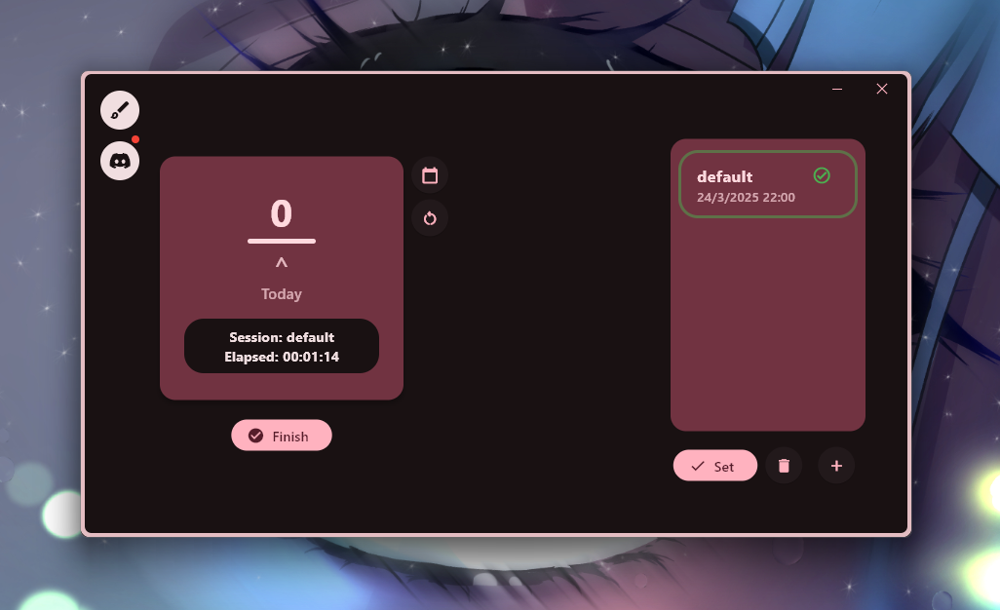
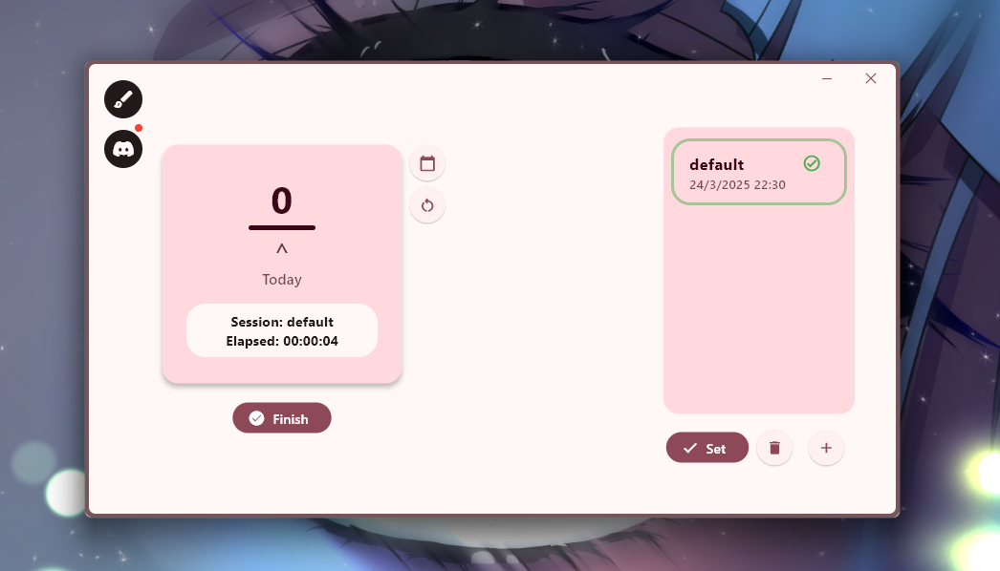
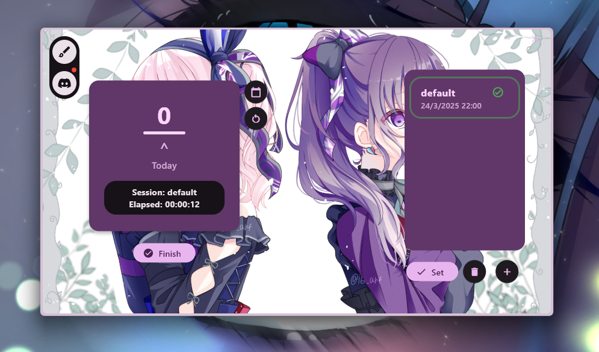
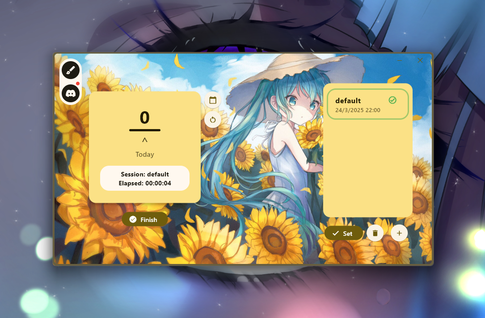
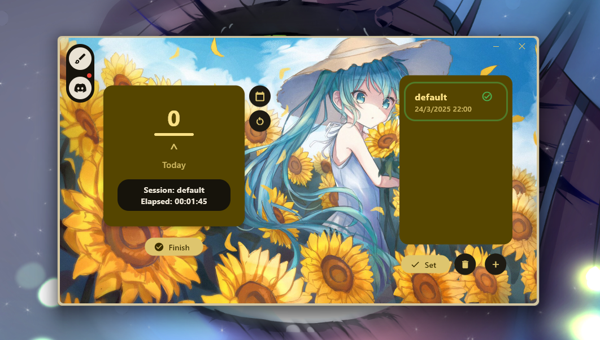
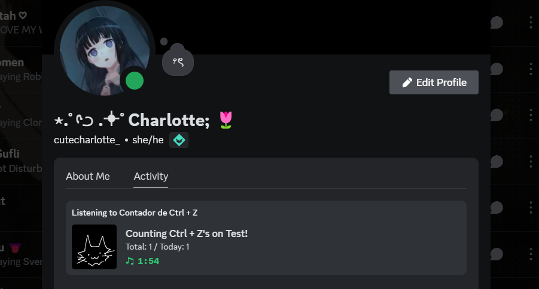

# Ctrl + Z Counter

## What is this exactly?
Essentially a program that counts the times you undo an action in any drawing, design, modeling, etc. app.
It hooks the keyboard to globally listen to the Ctrl + Z combination, as of right now, without process filtering. 
I... kind of overdid this. You will understand why after you see the list of features.

## Inspiration
Oh well... I have an artist friend. This friend in particular is pretty good at drawing almost everything; his style is cute, too. But... the times he undoes a single line in a single second is kind of scary. Ever since we saw him draw something seriously, we made fun of him (in a friendly way) because of that. I won't say much more, but i ended up offering myself to make a program that would count how many times he used Ctrl + Z. So here we are!

This is actually the second iteration of the program... The first was actually a mess. Written in C++ and using wxWidgets! I never actually made the UI for it because i was just terrible at programming in a language other than JavaScript, and my C++ setup was just terrible. I had no idea how to fix my errors and i gave up; we are talking about 9, almost 10 months ago.
Nowadays, i'm more capable of programming in general; not just javascript. Let's say... i allowed myself to just learn and do, instead of hoping i learn something without actually trying it.

## When did i start this project?
I started learning Flutter and making this program on March 1, 2025. 

# Screenshots

    
First-time

### Dark

### Light

    
With background image
  

### Dark

### Light

### Dark 2

    
Discord RPC

## Features
- [x] System-wide key listener
- [x] Total click count for a session
- [x] Today's click count for a session
- [x] Total click count for a specific day (using a date picker)
- [x] Session list
- [x] Session status (did you finish your drawing?)
- [x] Discord RPC
- [x] Material You 3 UI
- [x] Light and Dark mode
- [x] Custom background image support (GIF support out of the box)
- [x] Background color palette generation
- [x] Random color selector (will replace with Material You color palette)
- [x] Silly finish animation (you will see for yourself)

## TO-DO

- [x] Minimize to tray
- [x] Settings
- [x] General info dialog
- [x] Fix some colors
- [ ] Integrate something for updates (ie. Squirrel)
- [x] Make the database management less of a mess (kinda?)
- [x] Fix Nightly GitHub Actions workflow to not recreate the entire folder structure
- [ ] Refactor some code
- [ ] Migrate all state management to Riverpod (after first release, i need to release it soon or i will feel bad)
- [x] Add launch on startup
- [ ] Add inno setup script